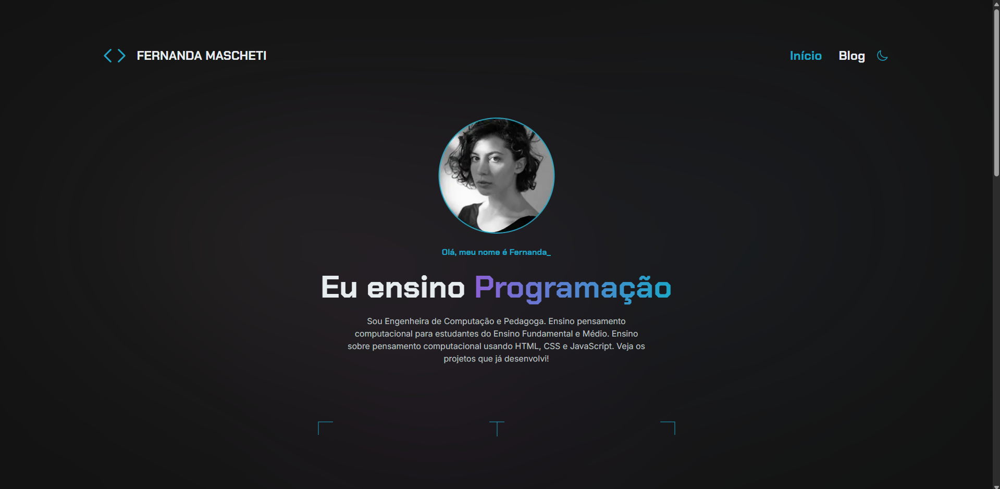

<h1 align="center">
  Teste Técnico - Alura
</h1>

  <a href="#-tecnologias">Tecnologias</a>&nbsp;&nbsp;&nbsp;|&nbsp;&nbsp;&nbsp;
  <a href="#-teste">Teste</a>&nbsp;&nbsp;&nbsp;|&nbsp;&nbsp;&nbsp;
  <a href="#-requisitos">Teste</a>&nbsp;&nbsp;&nbsp;|&nbsp;&nbsp;&nbsp;
  <a href="#-como-executar">Como executar</a>&nbsp;&nbsp;&nbsp;|&nbsp;&nbsp;&nbsp;
  <a href="#-licença">Licença</a>

## ✨ Tecnologias

O projeto foi desenvolvido com as seguintes tecnologias:

- [Next.js](https://nextjs.org)
- [TypeScript](https://www.typescriptlang.org)
- [TailwindCSS](https://tailwindcss.com/)
- [HeadlessUI](https://headlessui.com/)
- [Next Themes](https://github.com/pacocoursey/next-themes)

## 💻 Teste

O teste técnico consiste na implementação de uma aplicação front-end com base em um design do Figma, requisitando uma API fake para carregar as postagens e aplicando boas práticas de SEO, acessibilidade e responsividade.

- Design: https://www.figma.com/design/MOdixi2zYNtxwNyok05D6W/Desafio-NextJS
- API: https://nextjs-alura-teste.vercel.app

## Requisitos

- [x] Desenvolver a página inicial, exibindo dinamicamente as postagens com base nos dados da API;
- [x] Implementar filtros de postagens, permitindo ~~pesquisa por palavra-chave e~~ filtragem por categorias;
  - A API não suporta pesquisa por palavra-chave. Mas não seria um problema desenvolver usando o pattern BFF (Backend For Front-end) com uma rota de API privada do Next.js.
- [x] Adicionar paginação na listagem, limitando a exibição a 6 postagens por página;
- [x] Criar a página de detalhes da postagem, mostrando todas as informações (título, categorias, tags e descrição) com base no ID;
- [x] Exibir postagens relacionadas na página de detalhes, sugeridas conforme categorias ou tags semelhantes;
- [x] Garantir responsividade completa para desktop, tablet e dispositivos móveis;
- [x] Estruturar o projeto com componentes reutilizáveis para facilitar a manutenção e escalabilidade;
- [x] Aplicar boas práticas de SEO em todas as páginas;
- [x] Assegurar a acessibilidade para diferentes públicos e dispositivos;
- [x] Implementar a funcionalidade de tema claro/escuro como diferencial.

## 🚀 Como executar

Certifique-se de possuir uma versão do Node.js compatível com o projeto (>= v18) e o `pnpm` instalado.

Se estiver usando o `nvm` ([Node Version Manager](https://github.com/nvm-sh/nvm)), execute `nvm install`. Esse comando instalará a versão informada no arquivo `.nvmrc`, versão no qual esse projeto foi desenvolvido.

- Clone o repositório
- Instale as dependências com `pnpm i`
- Renomeie o arquivo `.env.example` para `.env.local`
- Inicie o servidor do Next.js com `pnpm dev`

A aplicação estará disponível na URL http://localhost:3000.

## 📄 Licença

Esse projeto está sob a licença MIT. Veja o arquivo [LICENSE](LICENSE.md) para mais detalhes.
